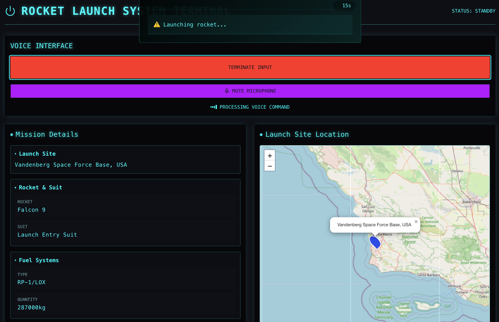
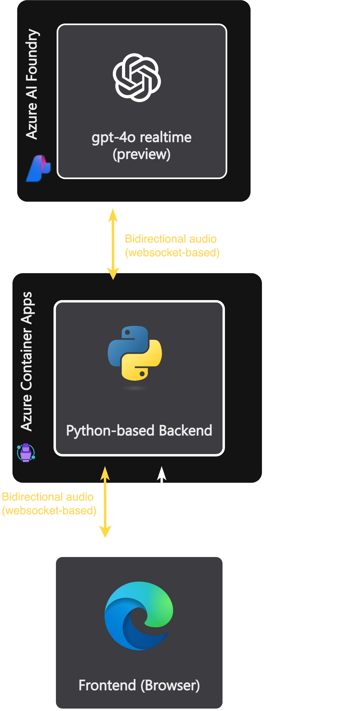

<div align="center">
  
  <h1>Voice-Controlled Space Program Agent</h1>
  
  <p><strong>A demo showcasing voice-controlled systems using Azure OpenAI's function calling capabilities</strong></p>
  
  [](https://azure.microsoft.com)
  [](https://python.org)
  [](https://reactjs.org)
  [](LICENSE)
  
  [Quickstart](#-quickstart) •
  [Architecture](#%EF%B8%8F-architecture) •
  [Installation](#-installation) •
  [API](#-api-endpoints)
</div>

---

## Overview

A demonstration project showcasing how to build voice-controlled systems using Azure OpenAI's Realtime API. This project highlights the integration of voice commands with function calling capabilities to control a simulated space program launch system. The agent uses function calling both for executing actions and dynamically presenting contextual information based on the launch configuration progress. It was originally based on code from https://github.com/Azure-Samples/aisearch-openai-rag-audio.

> **Note**: This demo shows how to combine voice interfaces with Azure OpenAI's function calling to create interactive command & control systems.

## 🚀 Quickstart

1. **Configure Environment**
   ```bash
   # Backend setup
   cd app/backend
   python -m venv .venv
   source .venv/bin/activate
   pip install -r requirements.txt
   
   # Create .env file with Azure OpenAI settings
   AZURE_OPENAI_API_KEY="<your-key>"
   AZURE_OPENAI_ENDPOINT="<your-endpoint>"
   AZURE_OPENAI_REALTIME_DEPLOYMENT="<deployment-name>"
   ```

2. **Start Application**
   ```bash
   # Start backend
   cd app/backend
   python app.py
   
   # Start frontend (new terminal)
   cd app/frontend
   npm install
   npm run dev
   ```

## 🗺️ Architecture

<div align="center">
  
</div>

## 📦 Installation

### Backend Requirements
```bash
# Install Python dependencies
pip install -r requirements.txt
```

### Frontend Requirements
```bash
# Install Node dependencies
npm install
```

## 🔌 API Endpoints

### GET /api/state
Returns current application state:
```json
{
    "selected_launch_site": "Cape Canaveral Space Launch Complex, Florida",
    "selected_rocket": "Falcon 9",
    "estimated_cost": "$67 million",
    "selected_suit": "Advanced Crew Escape Suit",
    "food_supplies": "Freeze-dried meals, fresh fruits",
    "fuel_type": "RP-1/LOX",
    "fuel_quantity": 287000,
    "launched": false
}
```

### GET /api/crew-photo
Generates AI images using DALL-E:
```json
{
    "image_url": "https://..."
}
```

## 🌐 Environment Variables

```bash
# Required Azure OpenAI Configuration
AZURE_OPENAI_API_KEY="your-api-key"
AZURE_OPENAI_ENDPOINT="your-endpoint"
AZURE_OPENAI_REALTIME_DEPLOYMENT="deployment-name"
AZURE_OPENAI_REALTIME_VOICE_CHOICE="echo"  # Optional
```

## 📚 Resources

- [Azure OpenAI Documentation](https://learn.microsoft.com/azure/cognitive-services/openai/)
- [Azure OpenAI Realtime API](https://learn.microsoft.com/en-us/azure/ai-services/openai/realtime-audio-quickstart)
- [OpenStreetMap](https://www.openstreetmap.org)